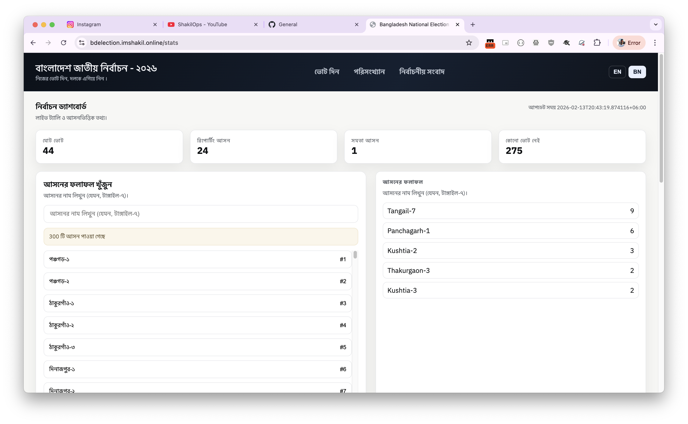
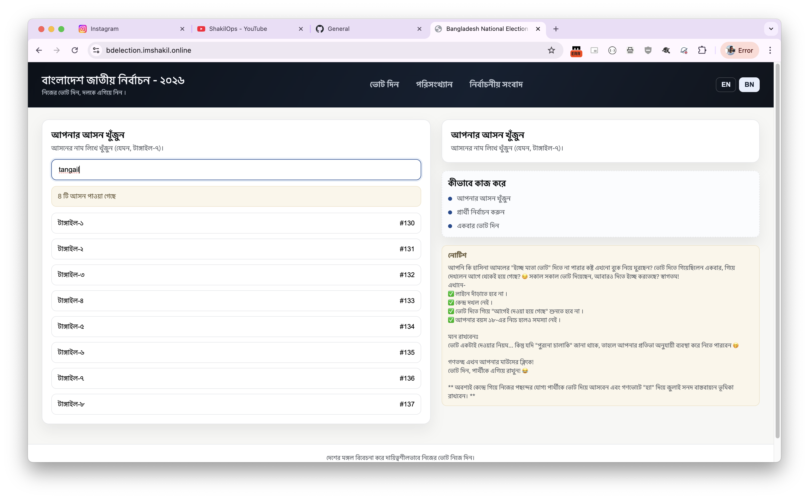
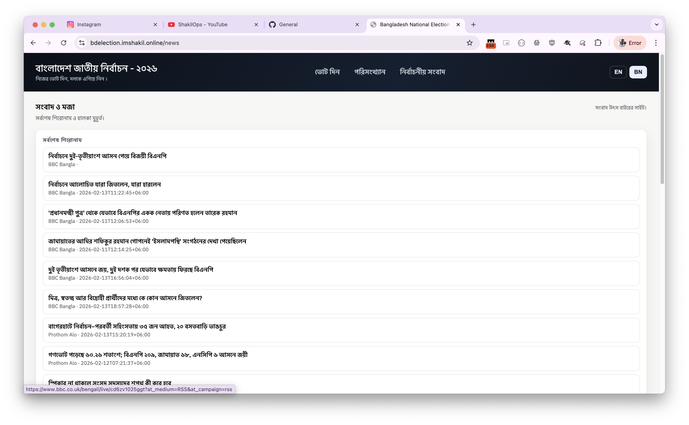

# Bangladesh National Election - 2026 (Online Voting)

A public demo web app that lets users vote for candidates by constituency on a Bangladesh constituency. Votes are stored in MongoDB Atlas. This is a **best‑effort** deterrence demo with no identity verification.

## What’s Included

- React SPA (Vite) with interactive constituency tile map
- Flask REST API with vote and stats endpoints
- MongoDB Atlas via `pymongo`
- CSV import script for `bd_elections_2026_candidates.csv`
- CAPTCHA support (Turnstile, reCAPTCHA, or `none`)
- Rate limiting (`Flask-Limiter`)

## Quick Start (Production-like via Docker Compose)

1. **Set env vars**
   - Copy `.env.example` to `.env` and update `MONGODB_URI` and `SERVER_SALT`.

2. **Run everything**

```bash
docker-compose up --build
```

This runs:

- `importer` one-shot service to load `bd_elections_2026_candidates.csv` into MongoDB
- `backend` with Gunicorn on `http://localhost:8000`
- `frontend` via Nginx on `http://localhost:5173`
- `redis` for rate limiting
- `mongo` for local MongoDB storage (volume `mongo_data`)

## Migration (Anytime)

Use the migrator service to copy data from any MongoDB to another.

1. Set in `.env`:

    ```bash
    SOURCE_MONGODB_URI=...
    TARGET_MONGODB_URI=...
    ```

2. Run:

    ```bash
    docker compose --profile tools run --rm migrator
    ```

## Local Dev (Optional)

```bash
cd backend
python -m venv .venv
source .venv/bin/activate
pip install -r requirements.txt
export $(grep -v '^#' ../.env | xargs)
python import_candidates.py
python app.py
```

```bash
cd frontend
npm install
npm run dev
```

## CAPTCHA Setup

- **Turnstile**: set `CAPTCHA_PROVIDER=turnstile`, and provide `CAPTCHA_SITE_KEY` + `CAPTCHA_SECRET_KEY`.
- **reCAPTCHA**: set `CAPTCHA_PROVIDER=recaptcha`, and provide keys.
- **Dev**: set `CAPTCHA_PROVIDER=none`.

## Important Limitations (Demo Mode)

- **No identity verification**: duplicates cannot be fully prevented.
- **No MAC address collection**: browsers do not expose MAC addresses. This app does **not** attempt to collect them.
- Deterrence used: cookie‑based device id, IP prefix, and user‑agent hash.

## Seats Leading Definition

- Each constituency’s leader is the candidate with the highest votes.
- If multiple candidates are tied for max votes, the constituency is marked **TIED** and not counted for any party/alliance.
- Constituencies with no votes are **NO_VOTES**.
- Disabled constituencies are excluded and counted separately.

## API (Summary)

- `GET /api/health`
- `GET /api/constituencies`
- `GET /api/constituencies/<no>`
- `POST /api/vote`
- `GET /api/results/overall`
- `GET /api/results/constituency/<no>`

## Notes

The map is rendered as a **tile map** for the MVP. If you add a real Bangladesh constituency GeoJSON or SVG mapping file, the map component can be extended to use it.

## Screenshots




